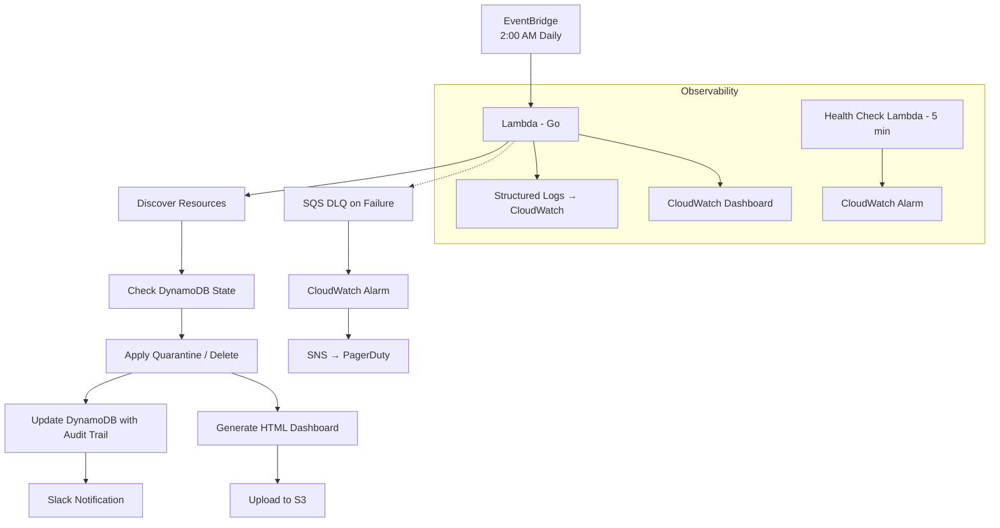
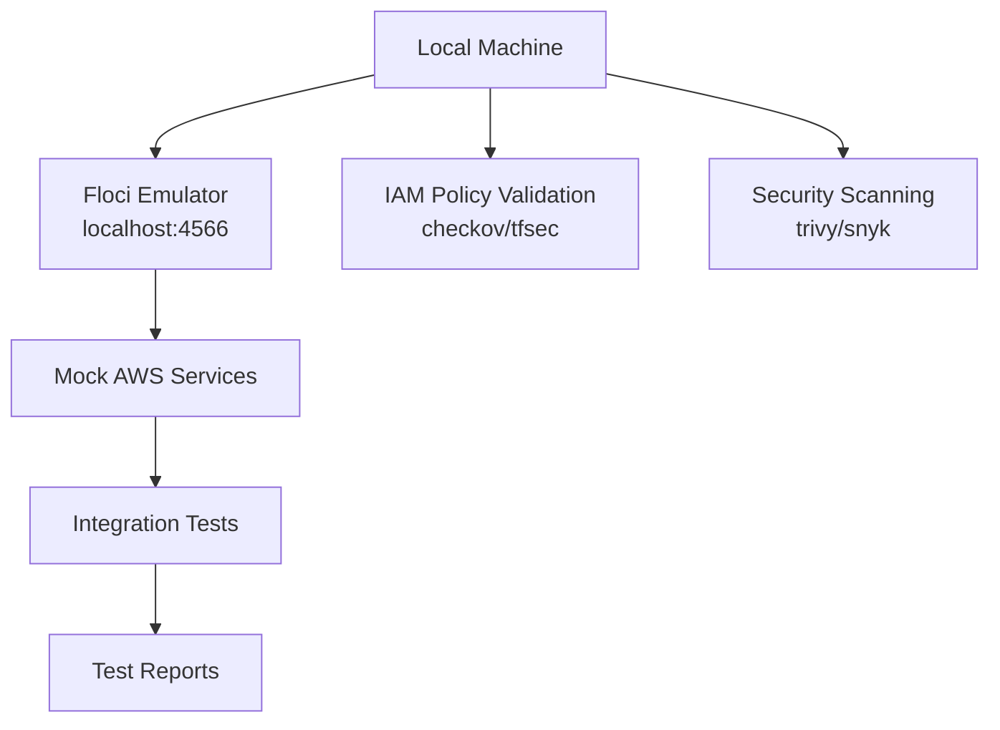

# Cloud FinOps Bot

> **Autonomous AWS Cost Optimization with Enterprise-Grade Safety Rails**

[](https://golang.org/)
[](https://aws.amazon.com/sdk-for-go/)
[](https://floci.io/aws/)
[](https://www.terraform.io/)
[]()

[](https://flowci.io/projects/your-project-name)
[](https://flowci.io/projects/your-project-name)
[](https://flowci.io/projects/your-project-name)

---

## 📖 Table of Contents

- [Overview](#overview)
- [Why This Project?](#why-this-project)
- [Key Features](#key-features)
- [Architecture](#architecture)
- [Tech Stack](#tech-stack)
- [Performance](#performance)
- [Operational Cost](#operational-cost)
- [Quick Start](#quick-start)
- [Troubleshooting](#troubleshooting)
- [Development](#development)
- [Security](#security)
- [Testing](#testing)
- [Deployment](#deployment)
- [Monitoring](#monitoring)
- [Documentation](#documentation)
- [Roadmap](#roadmap)
- [Contributing](#contributing)
- [FAQs](#faqs)
- [License](#license)
- [Contact](#contact)

---

## 🚀 Overview

### The Problem

Cloud waste silently drains **30-40% of engineering budgets**. Unattached EBS volumes, idle Elastic IPs, orphaned snapshots, and forgotten RDS databases accumulate over time, costing thousands of dollars annually. Engineering teams routinely spin up resources for testing and forget to tear them down.

### The Solution

**Cloud FinOps Bot** is an autonomous, serverless AWS Lambda function engineered with enterprise-grade safety rails. It:

- 🔍 **Scans** your AWS infrastructure daily for "zombie" resources
- 🚧 **Quarantines** suspicious resources for 7 days with Slack warnings
- 🪓 **Safely deletes** only after explicit confirmation (via tagging)
- 📊 **Provides** a visual dashboard showing your savings
- 🔒 **Maintains** a complete audit trail (who, what, when, where)

---

## 🤔 Why This Project?

| Aspect | What Makes This Different |
| :--- | :--- |
| **Zero-Cost Development** | Local development with Floci emulator - no AWS costs during development |
| **Enterprise Safety** | 7-day quarantine, explicit tagging, kill-switch, and dry-run mode |
| **Full Observability** | Structured logs with correlation IDs, audit trail (who/what/when/where), health checks |
| **Security-First** | Least-privilege IAM, secrets rotation, incident drills, break-glass procedures |
| **Production-Ready** | Comprehensive monitoring, SLOs, disaster recovery, and CI/CD pipeline |
| **Portfolio Value** | Demonstrates Go, AWS, Terraform, Security, and DevOps best practices |

---

## ✨ Key Features

### 🔐 Security & Observability

- **Least-Privilege IAM** — Every permission is explicitly scoped with conditions and resource restrictions
- **Audit Trail (Who/What/When/Where)** — Every action logged with IAM principal, source IP, correlation ID, and reason
- **Structured Logging** — JSON logs with correlation IDs for end-to-end tracing
- **Secrets Rotation** — Slack webhook URL can be rotated without code changes
- **Health Check** — Dedicated Lambda verifying connectivity to all dependencies
- **Incident Drills** — Documented procedures for compromised bot, broad IAM permissions, secrets exposure, and regional failure
- **Disaster Recovery** — RTO ≤ 30 minutes, RPO ≤ 24 hours for regional failures

### 💰 Cost Optimization

- **EBS Volumes** — Delete unattached volumes older than 7 days
- **Elastic IPs** — Release unassociated EIPs
- **EBS Snapshots** — Delete snapshots older than 30 days (preserving the latest 3 per volume)
- **RDS Instances** — Stop idle, standalone RDS instances
- **Multi-Region Scanning** — Scan across multiple AWS regions concurrently

### 🛡️ Safety Mechanisms

- **7-Day Quarantine** — Resources are tagged with `Pending_Deletion` for 7 days before action
- **Explicit Confirmation** — Deletion requires `FinOps: AutoPurge` tag
- **Kill-Switch** — `EXCLUDED_IDS` environment variable for emergency protection
- **Dry-Run Mode** — Test without making any changes (default: `true`)
- **IAM Conditions** — All write actions restricted by resource tags and conditions

### 📊 Visibility

- **Static HTML Dashboard** — Savings trends with Chart.js, hosted on S3
- **Slack Notifications** — Real-time alerts for quarantine, deletion, and errors
- **CloudWatch Dashboard** — Operational metrics at a glance
- **Structured Logs** — CloudWatch Logs Insights queries for fast troubleshooting

---

## 🏗️ Architecture

### Architecture Description

**Production Flow:**
1. EventBridge triggers Lambda daily at 2:00 AM
2. Lambda discovers zombie resources (EBS, EIPs, Snapshots, RDS)
3. DynamoDB provides state tracking and idempotency
4. Resources are quarantined (7 days) or deleted (if AutoPurge tag present)
5. Slack notifications and S3 dashboard updates
6. Structured logs flow to CloudWatch; errors route to SQS DLQ

### Production Architecture Diagram



### Development Architecture (Floci)



---

## 🧰 Tech Stack

| Category | Technology | Purpose |
| :--- | :--- | :--- |
| **Language** | Go 1.21+ | High-performance Lambda runtime |
| **AWS SDK** | AWS SDK for Go v2 | AWS service interactions |
| **Lambda Runtime** | `provided.al2` (Custom Runtime) | Go binary execution |
| **State Storage** | DynamoDB | Audit trail, idempotency, GSIs |
| **Logging** | CloudWatch Logs | Structured JSON logging |
| **Monitoring** | CloudWatch Dashboard + Alarms | Operational visibility |
| **Secrets** | AWS Secrets Manager + KMS | Secure secret storage |
| **Configuration** | SSM Parameter Store | Non-sensitive config |
| **CI/CD** | FlowCI | Automated build, test, deploy |
| **IaC** | Terraform | Infrastructure provisioning |
| **Local Emulator** | Floci | Zero-cost AWS emulation |
| **Testing** | Go testing + testify | Unit and integration tests |
| **Security** | checkov, tfsec, trivy, snyk | Security validation |
| **Frontend** | HTML + Chart.js + S3 | Cost savings dashboard |

---

## ⚡ Performance

| Metric | Value |
| :--- | :--- |
| **Cold Start Time** | < 100ms (Go runtime) |
| **Warm Start Time** | < 10ms |
| **Typical Run Duration** | 60-180 seconds (depends on resource count) |
| **Memory Usage** | ~256 MB |
| **Concurrent Executions** | 1 (reserved concurrency) |
| **Regions Scanned** | Up to 3 (configurable) |
| **Resource Discovery** | Paginated for large accounts (100+ resources) |

---

## 💰 Operational Cost

| Service | Monthly Cost (Est.) | Notes |
| :--- | :--- | :--- |
| **Lambda** | < $0.10 | 1 invocation/day, 256 MB, 5 min |
| **DynamoDB** | < $0.10 | PAY_PER_REQUEST, low throughput |
| **S3** | < $0.05 | 10-50 MB storage, low requests |
| **SQS** | < $0.01 | 1-10 messages/month |
| **Secrets Manager** | < $0.50 | 1 secret, 30-day recovery |
| **KMS** | < $0.10 | Key rotation, decryption |
| **CloudWatch** | < $0.50 | Logs (30-day retention), metrics, alarms |
| **SNS** | < $0.10 | 1-10 notifications/month |
| **Total** | **< $1.50/month** | |

**Notes:**
- All estimates are based on **us-east-1** pricing as of June 2026.
- CloudWatch cost assumes **30-day log retention**.
- Data transfer costs are negligible for this usage pattern (< 1 GB/month).
- Costs may vary slightly by region.

**Savings Potential:** The bot typically identifies **$50-$500/month** in savings, making it **cost-negative** (saves more than it costs).

---

## 🚀 Quick Start

### Prerequisites

| Tool | Version | Installation |
| :--- | :--- | :--- |
| **Go** | 1.21+ | [golang.org](https://golang.org/dl/) |
| **Docker** | Latest | [docker.com](https://www.docker.com/get-started/) |
| **Floci** | Latest | `brew install floci-io/floci/floci` |
| **Terraform** | 1.5+ | [terraform.io](https://developer.hashicorp.com/terraform/downloads) |
| **AWS CLI** | Latest | [aws.amazon.com/cli](https://aws.amazon.com/cli/) |

### Clone and Setup

```bash
# Clone the repository
git clone https://github.com/yourusername/finops-bot.git
cd finops-bot

# Run the setup script
./scripts/setup.sh

# Review and update environment variables
cp .env.example .env
vim .env

# Start Floci (local AWS emulator)
make floci-start

# Verify Floci is healthy
make floci-health

# Build the Lambda binary
make build

# Run the bot locally
make run-local
```

### Quick Commands

```bash
make help                          # Show all available commands
make build                         # Build Lambda binary
make test                          # Run unit tests
make integration-test              # Run integration tests with Floci
make run-local                     # Run Lambda locally
make generate-dashboard            # Generate HTML dashboard locally
make deploy                        # Deploy to AWS (requires credentials)
```

---

## 🔧 Troubleshooting

### Floci Fails to Start

```bash
# Check if Docker is running
docker ps

# Check Floci logs
floci logs

# Restart Floci
floci stop && floci start

# Use docker-compose as fallback
docker-compose up -d
```

### Permission Errors

```bash
# Verify AWS credentials are set
aws sts get-caller-identity

# Check IAM role permissions
aws iam list-attached-role-policies --role-name finops-lambda-role-dev
```

### Go Build Fails

```bash
# Clean and rebuild
make clean
go mod tidy
make build
```

### Secrets Manager Access Denied

```bash
# Verify KMS key permissions
aws kms describe-key --key-id alias/finops-secrets-dev

# Verify secret exists
aws secretsmanager get-secret-value --secret-id finops/slack-webhook-dev
```

---

## 💻 Development

### Project Structure

```
finops-bot/
├── cmd/
│   └── main.go                     # Lambda entry point
│   └── health_check.go             # Health check Lambda
├── internal/
│   ├── config/                     # Configuration loading
│   ├── ec2/                        # EC2 discovery and operations
│   ├── rds/                        # RDS discovery and operations
│   ├── dynamodb/                   # State tracking with audit fields
│   ├── pricing/                    # Cost calculation engine
│   ├── slack/                      # Slack notifications
│   ├── s3/                         # S3 upload and dashboard
│   ├── secrets/                    # Secrets Manager + SSM
│   ├── logger/                     # Structured logging
│   └── utils/                      # Utilities (correlation ID, etc.)
├── tests/
│   ├── unit/                       # Unit tests (pure Go)
│   ├── integration/                # Integration tests (with Floci)
│   └── e2e/                        # End-to-End tests (real AWS)
├── terraform/                      # Terraform IaC
├── scripts/                        # Setup and utility scripts
├── go.mod
├── go.sum
├── Makefile
├── .env.example
├── docker-compose.yml
├── .pre-commit-config.yaml
└── .flowci.yml
```

### Development Workflow

```bash
# 1. Make changes to the code
vim internal/ec2/discovery.go

# 2. Build and test locally
make build
make test

# 3. Run integration tests with Floci
make floci-start
make integration-test
make floci-stop

# 4. Generate dashboard locally
make generate-dashboard
open dashboard.html

# 5. Deploy to AWS sandbox
make deploy
```

### Coding Standards

- **Go Formatting:** `go fmt ./...` (enforced by pre-commit hook)
- **Linting:** `golangci-lint run ./...` (enforced by pre-commit hook)
- **Test Coverage:** Maintain > 80% coverage
- **Structured Logging:** All logs include `correlation_id`, `who`, `what`, `when`, `where`
- **Audit Trail:** All state writes include `ActionedBy`, `SourceIP`, `CorrelationID`, `ActionReason`
- **Error Handling:** All errors are wrapped with context using `fmt.Errorf("...: %w", err)`

---

## 🔒 Security

### IAM Least-Privilege

All IAM policies are explicitly scoped with conditions and resource restrictions:

```json
{
  "Sid": "EC2DeleteWithTagCondition",
  "Effect": "Allow",
  "Action": "ec2:DeleteVolume",
  "Resource": "*",
  "Condition": {
    "StringEquals": {
      "aws:ResourceTag/FinOps": "AutoPurge"
    }
  }
}
```

### Secrets Management

- **Secrets Manager:** Slack webhook URL (encrypted with KMS)
- **SSM Parameter Store:** Non-sensitive configuration (regions, retention days)
- **KMS:** Customer-managed key with rotation (365 days)
- **IAM:** No hardcoded credentials; all authentication via IAM roles

### Audit Trail

Every resource modification is audited in DynamoDB with:

- `ActionedBy` — IAM principal ARN
- `SourceIP` — Source IP address
- `CorrelationID` — Unique invocation ID
- `ActionReason` — Why the action was taken
- `StatusHistory` — Full status change history

### Incident Drills

Documented drill scenarios:

1. **Compromised Bot** — Stop, rotate secrets, investigate
2. **Broad IAM Permissions** — Review, rollback, reapply least-privilege
3. **Secrets Exposure** — Rotate, investigate, revoke
4. **Regional Failure** — Activate secondary region, restore data
5. **DynamoDB Corruption** — Restore from PITR

---

## 🧪 Testing

### Test Pyramid

```
         ┌─────────────┐
         │   E2E Tests  │  ← 5-10 tests (real AWS, optional)
         │   (5-10)     │
      ┌──────────────────┐
      │ Integration Tests│  ← 30-50 tests (Floci emulator)
      │   (30-50)       │
   ┌───────────────────────┐
   │   Unit Tests (50-80)  │  ← Pure Go, no external dependencies
   └───────────────────────┘
```

### Running Tests

```bash
# Unit tests
make test

# Integration tests (with Floci)
make integration-test

# E2E tests (requires AWS credentials)
make e2e-test

# Coverage report
go test ./... -coverprofile=coverage.out
go tool cover -html=coverage.out
```

### Security Validation

```bash
# IAM Policy Validation
checkov -d terraform/ --framework terraform
tfsec terraform/

# Vulnerability Scanning
trivy fs . --severity HIGH,CRITICAL
snyk test --severity-threshold=high

# Secret Detection
gitleaks detect -v
```

---

## 🚢 Deployment

### Environments

| Environment | Purpose | DRY_RUN | Regions |
| :--- | :--- | :--- | :--- |
| **dev** | Development testing | `true` | us-east-1 |
| **staging** | Pre-production validation | `true` | us-east-1, us-west-2 |
| **prod** | Production | `false` | us-east-1, us-west-2, eu-west-1 |

### Terraform Deployment

```bash
# Initialize Terraform
cd terraform
terraform init

# Plan deployment
terraform plan -var-file=terraform.tfvars -out=tfplan

# Apply deployment
terraform apply -auto-approve tfplan

# Verify outputs
terraform output
```

### CI/CD Pipeline (FlowCI)

The pipeline runs:

1. **Lint & Format** — Code quality checks
2. **IAM Policy Validation** — checkov and tfsec
3. **Security Scanning** — trivy and snyk
4. **Unit Tests** — Coverage gate (80%+)
5. **Integration Tests** — Floci emulator
6. **Build Binary** — Go compilation
7. **Terraform Plan & Apply** — Infrastructure provisioning
8. **E2E Tests** — Real AWS validation
9. **Smoke Tests** — Health check verification
10. **Slack Notification** — Deployment status

---

## 📊 Monitoring

### CloudWatch Dashboard

Pre-configured dashboard with widgets for:

- Lambda errors, duration, invocations, throttles
- SQS DLQ depth
- DynamoDB latency
- S3 object count
- Health check status

### SLAs & SLOs

| Metric | Target | Measurement |
| :--- | :--- | :--- |
| Bot Run Success Rate | > 99% | Daily runs without errors |
| Bot Run Duration | < 300 seconds | Lambda p95 duration |
| Slack Notification Delivery | > 99% | Webhook success rate |
| Dashboard Availability | > 99.9% | S3 website endpoint |
| Health Check Availability | > 99.9% | Health check endpoint |
| Incident Response (P1) | < 5 minutes | Time to stop bot |

### Alerts

- **Lambda Errors** — SNS notification
- **Lambda Duration** — SNS notification (p90 > 250s)
- **DLQ Depth** — SNS notification (depth > 1)
- **Health Check Failure** — SNS notification (3 consecutive failures)
- **Low Invocation Count** — SNS notification (no runs in 24 hours)
- **Lambda Throttles** — SNS notification

---

## 📚 Documentation

Comprehensive documentation is available in the `docs/` directory:

| Document | Description |
| :--- | :--- |
| **[Project Charter](docs/01-project-charter.md)** | Scope, goals, and success criteria |
| **[High-Level Design](docs/02-high-level-design.md)** | Architecture and data flow |
| **[DynamoDB Schema](docs/03-dynamodb-schema.md)** | State tracking with audit fields |
| **[Configuration Matrix](docs/04-configuration-matrix.md)** | Env vars, secrets, and SSM |
| **[Pricing Engine](docs/05-pricing-engine.md)** | Cost calculation formulas |
| **[Low-Level Design](docs/06-low-level-design.md)** | Go implementation details |
| **[IaC Manifest](docs/07-iac-manifest.md)** | Terraform infrastructure |
| **[Security & IAM Matrix](docs/08-security-iam-matrix.md)** | Least-privilege policies |
| **[Test Strategy](docs/09-test-strategy.md)** | Unit, integration, E2E tests |
| **[On-Call Runbook](docs/10-oncall-runbook.md)** | Incident response and drills |
| **[CI/CD Pipeline](docs/11-cicd-pipeline.md)** | FlowCI configuration |
| **[Frontend Dashboard](docs/12-frontend-dashboard.md)** | HTML dashboard design |

---

## 🗺️ Roadmap

- [x] Core EC2, EIP, and Snapshot cleanup
- [x] RDS idle detection and stopping
- [x] Static HTML dashboard with Chart.js
- [x] Health check Lambda
- [x] Incident drills and DR strategy
- [x] Complete documentation suite
- [ ] AWS Cost Explorer integration
- [ ] Multi-account Organizations support
- [ ] React-based dashboard with authentication
- [ ] Slack interactive commands (approve/reject deletions)
- [ ] AWS Lambda Power Tuning integration
- [ ] Automated incident drills via Chaos Engineering

---

## 🤝 Contributing

### How to Contribute

1. Fork the repository
2. Create a feature branch (`git checkout -b feature/amazing-feature`)
3. Commit your changes (`git commit -m 'Add amazing feature'`)
4. Ensure tests pass (`make test && make integration-test`)
5. Push to the branch (`git push origin feature/amazing-feature`)
6. Open a Pull Request

### Contribution Guidelines

- Write tests for new functionality
- Maintain > 80% test coverage
- Follow Go coding standards
- Include structured logging
- Document all public functions
- Run `make lint` before committing

### Code of Conduct

Please be respectful and constructive in all interactions. This project is a learning resource, and we aim to foster an inclusive environment.

---

## ❓ FAQs

### Q: What happens if the bot accidentally deletes a resource?

**A:** The bot uses a 7-day quarantine and requires explicit `FinOps: AutoPurge` tagging before deletion. Additionally, the IAM policy condition `aws:ResourceTag/FinOps == "AutoPurge"` prevents deletion without the tag. This provides two layers of protection.

### Q: Can I run the bot without an AWS account?

**A:** Yes! Floci emulates AWS locally, allowing full development and integration testing without an AWS account. This is one of the key differentiators of this project.

### Q: How do I stop the bot in an emergency?

**A:** Run `make emergency-stop` or manually:
```bash
aws events disable-rule --name finops-daily-trigger-dev
aws lambda update-function-configuration --function-name finops-cleaner-dev --environment "Variables={DRY_RUN=true}"
```

### Q: What if I have thousands of resources?

**A:** The bot uses pagination for large accounts. You may need to increase Lambda timeout and memory (configurable in Terraform). The default timeout is 300 seconds and memory is 256 MB.

### Q: Can I add custom resource types?

**A:** Yes! The architecture is modular. Add new discovery functions in `internal/` and update the runner. The DynamoDB schema supports additional resource types via the `ResourceType` field.

### Q: How do I rotate the Slack webhook URL?

**A:** Update the secret in Secrets Manager:
```bash
aws secretsmanager update-secret --secret-id finops/slack-webhook-dev --secret-string '{"SLACK_WEBHOOK_URL":"https://hooks.slack.com/services/NEW_WEBHOOK"}'
```
The Lambda will fetch the new value on the next invocation.

### Q: What's the difference between the main bot and the health check Lambda?

**A:** The main bot runs daily at 2:00 AM and does the actual resource cleanup. The health check Lambda runs every 5 minutes and only verifies connectivity to dependencies (DynamoDB, S3, Secrets Manager, SSM). The health check does not perform any resource modifications.

### Q: How is the bot tested in CI?

**A:** The CI pipeline runs unit tests, integration tests against the Floci emulator, IAM policy validation (checkov/tfsec), and security scanning (trivy/snyk). E2E tests against real AWS are optional and run only on the `main` branch.

### Q: What is the disaster recovery strategy?

**A:** See the [On-Call Runbook](docs/10-oncall-runbook.md#9-disaster-recovery-strategy) for full details. In summary: regional failure → deploy to secondary region (RTO 30 min); DynamoDB corruption → restore from PITR (RTO 15 min); S3 bucket deletion → restore from versioning (RTO 10 min).

---

## 📄 License

TBD

---

## 📬 Contact

**Author:** Jibrin Ahmed

- **GitHub:** [@FleshedOutThoughts69](https://github.com/FleshedOutThoughts69)
- **Email:** JibrinAhmed@gmail.com

---

## 🙏 Acknowledgments

- [AWS SDK for Go](https://github.com/aws/aws-sdk-go-v2) — AWS service interactions
- [Floci](https://floci.io/aws/) — AWS emulator for local development
- [Terraform](https://www.terraform.io/) — Infrastructure as Code
- [Chart.js](https://www.chartjs.org/) — Dashboard charts
- [checkov](https://www.checkov.io/) — IAM policy validation
- [tfsec](https://tfsec.dev/) — Terraform security scanning
- [trivy](https://trivy.dev/) — Vulnerability scanning
- [snyk](https://snyk.io/) — Dependency vulnerability scanning

---

## ⭐ Star History

If you find this project useful, please consider giving it a star ⭐ on GitHub!

---

## 📝 Changelog

| Version | Date | Changes |
| :--- | :--- | :--- |
| 1.0.0 | 2026-06-22 | Initial release |
| 1.0.1 | 2026-06-22 | Added health check, DR strategy, SLOs |
| 1.0.2 | 2026-06-22 | Updated documentation and testing |

---

**Built with ❤️ and Go**

