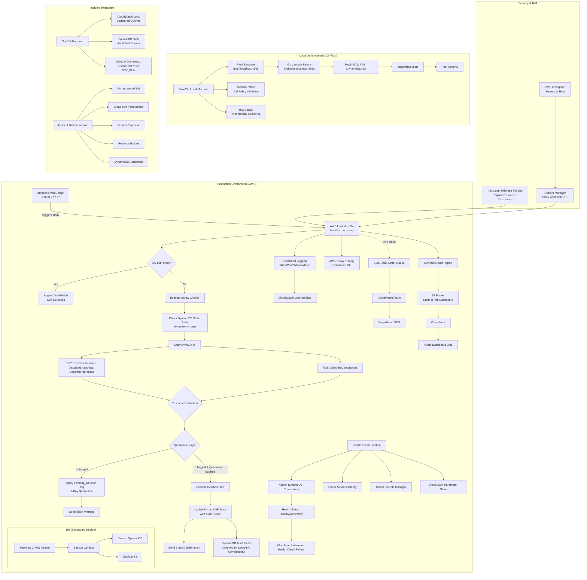

Here is the **fully patched version of Document 02: High-Level Design (HLD)** with all critical gaps fixed, including the **Health Check API**, **SLOs**, **Data Retention Policy**, and **Disaster Recovery Strategy** integration.

---

# High-Level Design (HLD): Cloud FinOps Bot

**Document:** 02
**Version:** 3.1 (Go Edition - Fully Patched)
**Author:** Jibrin Ahmed
**Date:** June 22, 2026
**Status:** Final

---

## 1. Document Purpose

This document provides a high-level architectural overview of the Cloud FinOps Bot. It describes the system components, data flow, interactions, security mechanisms, observability strategy, and development/testing workflow.

**Audience:**
- **Development Team:** Implementation guide.
- **Security Reviewers:** Validation of security architecture.
- **Technical Reviewers:** Architecture validation.
- **Future Employers:** Demonstrates architectural depth and security awareness.

---

## 2. System Context Diagram

The following diagram illustrates the end-to-end architecture of the FinOps Bot, including:

- **Production Environment:** AWS services and data flow.
- **Security & Observability:** IAM policies, structured logging, audit trail.
- **Health Check:** Dedicated health check endpoint.
- **Local Development:** Floci emulator and CI pipeline.
- **Incident Response:** How the bot supports incident drills.



---

## 3. Narrative Data Flow

### 3.1 Production Flow

1. **Scheduled Trigger:** Amazon EventBridge invokes the AWS Lambda function daily at 2:00 AM UTC.

2. **Lambda Initialization:**
   - The Go binary (`bootstrap`) starts.
   - A **Correlation ID** is generated for this invocation (for end-to-end tracing).
   - It loads configuration from environment variables (`DRY_RUN`, `EXCLUDED_IDS`, `COST_PER_GB`, etc.).
   - It fetches the Slack Webhook URL from AWS Secrets Manager (decrypted via KMS).
   - It fetches non-sensitive configuration from SSM Parameter Store.
   - It initializes structured logging with the Correlation ID.

3. **Resource Discovery:**
   - The Lambda uses **AWS SDK for Go v2** to query EC2 for:
     - Unattached EBS volumes (`status == 'available'`).
     - Unassociated Elastic IPs (`association_id == None`).
     - Stale snapshots (older than 30 days, excluding the latest 3 per volume, and **not** backing any registered AMI).
   - It queries RDS for:
     - Standalone instances (`ReadReplicaDBInstanceIdentifiers` empty) with `DBInstanceStatus == 'available'` and `InstanceCreateTime > 7 days`.

4. **Idempotency Check:** Before acting on any resource, the Lambda queries the **DynamoDB State Table** (`FinOps-State`) to check if the resource has already been processed. If the resource has a `DELETED` status, it is skipped entirely (preventing duplicate API calls).

5. **Quarantine & Decision Logic:**
   - **Step 1 (Kill-Switch):** If the resource ID matches any ID in the `EXCLUDED_IDS` environment variable, it is skipped unconditionally.
   - **Step 2 (Quarantine):** If the resource lacks the `FinOps: AutoPurge` tag, the Lambda applies a `Pending_Deletion: <expiry_date>` tag (7 days from now) and sends a Slack warning.
   - **Step 3 (Deletion):** If the resource already has the `Pending_Deletion` tag AND the expiry date has passed AND the `FinOps: AutoPurge` tag is present, the Lambda executes the deletion (or stop, for RDS).

6. **State Update with Audit Trail:**
   - Upon successful deletion, the Lambda writes a record to DynamoDB with:
     - `ActionTaken: 'DELETED'`
     - `DeletionTimestamp`
     - `SizeGB`
     - `EstimatedSavings`
     - **`ActionedBy`:** The IAM principal ARN that performed the action.
     - **`SourceIP`:** The source IP address of the request (if available).
     - **`CorrelationID`:** The unique identifier for the entire invocation.

7. **Audit & Reporting:**
   - A JSON audit log is generated and uploaded to an S3 bucket.
   - An HTML dashboard (with Chart.js) is generated from the audit history and uploaded to the same S3 bucket, configured for static website hosting.
   - A summary Slack notification is sent.

8. **Health Check (NEW):**
   - A dedicated Lambda function (`health-check`) runs on a separate schedule (e.g., every 5 minutes).
   - It verifies:
     - DynamoDB connectivity (`GetItem` on `FinOps-State`).
     - S3 bucket accessibility (`HeadBucket` on audit bucket).
     - Secrets Manager accessibility (`GetSecretValue` on Slack webhook secret).
     - SSM Parameter Store accessibility (`GetParameter` on `/finops/*` parameters).
   - If any check fails, it increments a CloudWatch metric (`HealthCheckStatus`).
   - A CloudWatch Alarm triggers if the bot is unhealthy for 3 consecutive checks.

9. **Error Handling:** If the Lambda fails three times consecutively, the event is routed to an SQS Dead-Letter Queue. A CloudWatch Alarm triggers an SNS notification for manual intervention.

10. **Structured Logging:**
    - Every action is logged with:
      - **`who`:** IAM principal ARN.
      - **`what`:** Action performed (e.g., `QUARANTINE_VOLUME`, `DELETE_VOLUME`, `STOP_RDS`).
      - **`when`:** Timestamp (UTC).
      - **`where`:** Source IP (if available).
      - **`correlation_id`:** Unique identifier for the invocation.
      - **`resource_id`:** The AWS resource ID.
      - **`resource_type`:** The resource type (EBS_VOLUME, EIP, SNAPSHOT, RDS_INSTANCE).

---

### 3.2 Local Development Flow (Floci)

1. The developer starts Floci locally: `floci start`.
2. The Go Lambda binary is built with `GOOS=linux GOARCH=amd64 go build -o bootstrap`.
3. The Lambda is run locally (using a Floci-provided runtime or by directly executing the binary against `http://localhost:4566`).
4. Floci emulates all AWS services (EC2, RDS, DynamoDB, S3) using real Docker containers behind the scenes.
5. Integration tests run against the emulated environment, verifying:
   - Resource discovery.
   - Quarantine tagging.
   - Deletion logic.
   - DynamoDB state tracking with audit fields.
   - Structured logging output.
   - Slack notification formatting (mocked).
   - Health check functionality.
6. All tests pass without touching real AWS or incurring any cloud costs.

---

## 4. Key Components

### 4.1 AWS Lambda - Main Bot

| Attribute | Value |
| :--- | :--- |
| **Runtime** | `provided.al2` (Custom Runtime) |
| **Handler Signature** | `func HandleRequest(ctx context.Context, event events.CloudWatchEvent) error` |
| **Event Source** | Amazon EventBridge (Scheduled Event) |
| **Manual Override Payload** | Lambda supports manual invocation with a custom `EventBridge` event payload to bypass the scheduler for testing. |
| **Memory** | 256 MB (configurable) |
| **Timeout** | 300 seconds (5 minutes, configurable) |
| **Architecture** | `arm64` or `amd64` |
| **Reserved Concurrency** | `1` (prevents concurrent execution) |
| **Environment Variables** | `DRY_RUN`, `COST_PER_GB`, `EXCLUDED_IDS`, `REGIONS`, `QUARANTINE_DAYS`, `SNAPSHOT_RETENTION_DAYS`, `SNAPSHOTS_TO_KEEP`, `RDS_STOP_AGE_DAYS`, `LOG_LEVEL`, `SLACK_CHANNEL`, `S3_REPORT_BUCKET`, `S3_REPORT_PREFIX`, `TZ`, `SECRETS_MANAGER_ARN`, `ENABLE_RDS_SAVINGS`, `AWS_ENDPOINT_URL` (local override) |

### 4.2 AWS Lambda - Health Check (NEW)

| Attribute | Value |
| :--- | :--- |
| **Runtime** | `provided.al2` (Custom Runtime) |
| **Handler Signature** | `func HandleHealthCheck(ctx context.Context, event events.CloudWatchEvent) error` |
| **Event Source** | Amazon EventBridge (Scheduled Event - every 5 minutes) |
| **Memory** | 128 MB |
| **Timeout** | 30 seconds |
| **Reserved Concurrency** | `1` |
| **Purpose** | Validate connectivity to all dependencies; report health status |

### 4.3 DynamoDB State Table (Updated with Audit Fields)

| Attribute | Type | Description |
| :--- | :--- | :--- |
| `ResourceId` | String (Partition Key) | Unique resource identifier (e.g., `vol-12345`) |
| `AccountId` | String (Sort Key) | AWS account ID |
| `Region` | String | AWS region of the resource |
| `ActionTaken` | String | `QUARANTINED`, `DELETED`, `SKIPPED`, `STOPPED`, `DELETION_FAILED` |
| `ResourceType` | String | `EBS_VOLUME`, `EIP`, `SNAPSHOT`, `RDS_INSTANCE` |
| `ActionedBy` | String | **NEW:** IAM principal ARN that performed the action |
| `SourceIP` | String | **NEW:** Source IP address of the request (if available) |
| `CorrelationID` | String | **NEW:** Unique identifier for the Lambda invocation |
| `ActionReason` | String | **NEW:** Reason for the action (e.g., `Quarantine expired with AutoPurge tag`) |
| `SizeGB` | Number | Volume or snapshot size in GB |
| `EstimatedSavings` | Float | Estimated monthly savings in USD |
| `QuarantineExpiry` | Number | Unix timestamp when quarantine expires |
| `DeletionTimestamp` | Number | Unix timestamp when resource was deleted/stopped |
| `ExpirationTimestamp` | Number (TTL Field) | Auto-deletes records after 90 days |
| `Version` | Number | Optimistic locking version |
| `RetryCount` | Number | Number of consecutive failed deletion attempts |
| `DeleteProtection` | Boolean | If `true`, skip this resource unconditionally |
| `StatusHistory` | List of Maps | Tracks status changes over time |
| `Tags` | Map | Resource tags at time of action |

### 4.4 S3 Audit Bucket

| Attribute | Value |
| :--- | :--- |
| **Bucket Name** | `finops-audit-<environment>-<account-id>` (NEW - includes environment) |
| **Lifecycle Policy** | Transition to Glacier after 30 days; delete after 365 days |
| **Static Website Hosting** | Enabled (for the HTML dashboard) |
| **Public Access** | Blocked (dashboard accessed via CloudFront with Origin Access Control) |
| **Server-Side Encryption** | AES256 (mandatory) |
| **Versioning** | Enabled |
| **Cross-Region Replication** | Optional (for DR) |

### 4.5 SQS Dead-Letter Queue

| Attribute | Value |
| :--- | :--- |
| **Queue Name** | `finops-dlq-<environment>` |
| **Retention Period** | 14 days |
| **Visibility Timeout** | 30 seconds |
| **Redrive Policy** | Max receive count: 3 |

### 4.6 CloudWatch Dashboard (NEW)

| Attribute | Value |
| :--- | :--- |
| **Dashboard Name** | `FinOps-Bot-Dashboard-<environment>` |
| **Widgets** | Lambda Errors, Duration, Invocations, DLQ Depth, DynamoDB Latency, S3 Objects, Health Check Status, SLO Compliance |

---

## 5. Structured Logging Strategy

### 5.1 Log Format (JSON)

All logs are emitted as structured JSON to CloudWatch Logs:

```json
{
  "timestamp": "2026-06-22T02:00:00.123Z",
  "level": "info",
  "correlation_id": "abc-123-def-456",
  "who": "arn:aws:sts::123456789012:assumed-role/finops-lambda-role-dev/finops-cleaner",
  "what": "DELETE_VOLUME",
  "where": "203.0.113.1",
  "resource_id": "vol-abc123",
  "resource_type": "EBS_VOLUME",
  "region": "us-east-1",
  "account_id": "123456789012",
  "message": "Volume deleted successfully",
  "estimated_savings": 8.00,
  "duration_ms": 1234,
  "slo_metric": "bot_run_success"
}
```

### 5.2 Structured Logging Fields

| Field | Description | Source |
| :--- | :--- | :--- |
| `timestamp` | UTC timestamp of the log entry | `time.Now().UTC()` |
| `level` | Log level (debug, info, warn, error) | Configurable |
| `correlation_id` | Unique identifier for the invocation | Generated at Lambda start |
| `who` | IAM principal ARN | Lambda context identity |
| `what` | Action performed | Application code |
| `where` | Source IP address (if available) | Lambda context identity |
| `resource_id` | AWS resource ID | EC2/RDS API |
| `resource_type` | Resource type | Application code |
| `region` | AWS region | Configuration |
| `account_id` | AWS account ID | Lambda context |
| `message` | Human-readable log message | Application code |
| `duration_ms` | Execution duration (for performance tracking) | `time.Since()` |
| `slo_metric` | SLO metric identifier | Application code |

### 5.3 CloudWatch Logs Insights Queries

```sql
-- Find all actions performed by a specific IAM principal
fields @timestamp, who, what, resource_id, resource_type
| filter who like /finops-lambda-role/
| sort @timestamp desc
| limit 100

-- Find all DELETE actions in the last 24 hours
fields @timestamp, what, resource_id, resource_type, estimated_savings
| filter what = "DELETE_VOLUME"
| filter @timestamp > now() - 24h
| sort @timestamp desc

-- Correlation ID tracking across the entire invocation
fields @timestamp, correlation_id, what, resource_id
| filter correlation_id = "abc-123-def-456"
| sort @timestamp asc

-- SLO tracking: Bot run success rate
fields @timestamp, slo_metric, level
| filter slo_metric = "bot_run_success"
| stats count(*) as total, count_if(level != "error") as success by bin(1d)
| eval success_rate = success / total * 100
```

---

## 6. Audit Trail (Who/What/When)

### 6.1 Audit Trail Design

| Action Type | What is Logged | Where |
| :--- | :--- | :--- |
| **Discovery** | Resources found, filters applied | CloudWatch Logs |
| **Quarantine** | Resource ID, type, region, expiry date | CloudWatch Logs + DynamoDB |
| **Deletion/Stop** | Resource ID, type, region, savings | CloudWatch Logs + DynamoDB |
| **Skip** | Resource ID, reason (e.g., kill-switch) | CloudWatch Logs + DynamoDB |
| **Error** | Resource ID, error message | CloudWatch Logs + DynamoDB |
| **Permission Denied** | IAM principal, attempted action | CloudWatch Logs + CloudTrail |
| **Health Check** | Status, timestamp, failed components | CloudWatch Logs + CloudWatch Metrics |

### 6.2 Audit Trail Query (DynamoDB)

```sql
-- Find all actions performed by a specific IAM principal
SELECT * FROM "FinOps-State"
WHERE ActionedBy = 'arn:aws:sts::123456789012:assumed-role/finops-lambda-role-dev/finops-cleaner'
AND DeletionTimestamp > unix_timestamp(now() - interval 7 day)
ORDER BY DeletionTimestamp DESC
LIMIT 100

-- Find all resources deleted in the last 7 days
SELECT * FROM "FinOps-State"
WHERE ActionTaken = 'DELETED'
AND DeletionTimestamp > unix_timestamp(now() - interval 7 day)

-- Find all DELETION_FAILED resources with RetryCount > 3
SELECT * FROM "FinOps-State"
WHERE ActionTaken = 'DELETION_FAILED'
AND RetryCount > 3
```

---

## 7. Health Check Implementation (NEW)

### 7.1 Health Check Lambda

```go
// cmd/health_check.go

package main

import (
    "context"
    "fmt"
    "github.com/aws/aws-lambda-go/events"
    "github.com/aws/aws-lambda-go/lambda"
    "github.com/aws/aws-sdk-go-v2/service/dynamodb"
    "github.com/aws/aws-sdk-go-v2/service/s3"
    "github.com/aws/aws-sdk-go-v2/service/secretsmanager"
    "github.com/aws/aws-sdk-go-v2/service/ssm"
)

func HandleHealthCheck(ctx context.Context, event events.CloudWatchEvent) error {
    status := HealthStatus{Healthy: true}
    errors := []string{}
    
    // Check DynamoDB
    if err := checkDynamoDB(ctx); err != nil {
        status.Healthy = false
        errors = append(errors, fmt.Sprintf("DynamoDB: %v", err))
    }
    
    // Check S3
    if err := checkS3(ctx); err != nil {
        status.Healthy = false
        errors = append(errors, fmt.Sprintf("S3: %v", err))
    }
    
    // Check Secrets Manager
    if err := checkSecretsManager(ctx); err != nil {
        status.Healthy = false
        errors = append(errors, fmt.Sprintf("Secrets Manager: %v", err))
    }
    
    // Check SSM
    if err := checkSSM(ctx); err != nil {
        status.Healthy = false
        errors = append(errors, fmt.Sprintf("SSM: %v", err))
    }
    
    // Emit CloudWatch metric
    status.Metric = "HealthCheckStatus"
    status.Value = 0
    if !status.Healthy {
        status.Value = 1
        // Log errors
        for _, err := range errors {
            logger.Error(ctx, "Health check failed", "error", err)
        }
    }
    
    return nil
}
```

### 7.2 CloudWatch Alarm

```hcl
# terraform/cloudwatch.tf

resource "aws_cloudwatch_metric_alarm" "health_check_alarm" {
  alarm_name          = "finops-health-check-alarm-${var.environment}"
  comparison_operator = "GreaterThanThreshold"
  evaluation_periods  = "3"
  metric_name         = "HealthCheckStatus"
  namespace           = "FinOpsBot"
  period              = "300"
  statistic           = "Average"
  threshold           = "0"
  alarm_description   = "FinOps Bot health check failed for 3 consecutive checks"
  alarm_actions       = [aws_sns_topic.alerts[0].arn]
}
```

---

## 8. Concurrency Strategy (Go)

- **Multi-Region Scanning:** The Lambda will spawn a **goroutine** for each configured region (us-east-1, us-west-2, eu-west-1).
- **WaitGroup:** A `sync.WaitGroup` will ensure the main function waits for all goroutines to complete before generating the final report.
- **Error Propagation:** Errors from individual goroutines will be collected via a channel and aggregated for logging.
- **Context Cancellation:** The Lambda will respect the `context.Context` provided by the runtime, enabling graceful shutdown on timeout.
- **Concurrency Limiter:** To prevent resource exhaustion, the goroutine pool will be limited to a maximum of **5 concurrent scanners**. We will use a buffered channel or `semaphore.Weighted` from the Go standard library.
- **Correlation ID Propagation:** The Correlation ID will be propagated to all goroutines and logs for end-to-end tracing.
- **Reserved Concurrency:** Lambda reserved concurrency set to `1` prevents race conditions.

---

## 9. Security & Compliance

- **IAM Least Privilege:** The Lambda execution role will only have permissions for explicitly required actions (see Document 08 for the full matrix). All write actions (`DeleteVolume`, `DeleteSnapshot`, `ReleaseAddress`, `StopDBInstance`) are restricted with explicit conditions.
- **Secrets Manager:** Slack Webhook URL is stored in AWS Secrets Manager, not in environment variables. Access is encrypted with a customer-managed KMS key.
- **KMS Encryption:** All secrets are encrypted at rest with a dedicated KMS key. The Lambda has `kms:Decrypt` permission on the key.
- **SigV4 Validation:** Floci fully supports AWS SigV4 authentication, allowing security testing locally.
- **No Hardcoded Credentials:** All AWS authentication is handled via IAM roles (production) or environment endpoints (local development).
- **Audit Trail:** All resource modifications are audited in DynamoDB with `ActionedBy`, `SourceIP`, and `CorrelationID`.
- **Structured Logging:** All logs are structured JSON with `who`, `what`, `when`, `where`, and `correlation_id`.
- **Secrets Rotation:** The Slack webhook URL can be rotated without code changes via Secrets Manager.
- **Data Retention:** All data retention policies are documented (Section 6 of Document 01).
- **SLO Monitoring:** All SLOs are monitored via CloudWatch metrics and alarms.

---

## 10. Incident Drill Integration

The HLD supports the following incident drill scenarios:

### 10.1 Compromised Bot Drill

**Scenario:** The bot is compromised and attempting to delete resources it shouldn't.

**HLD Support:**
- **DRY_RUN toggle:** The bot can be stopped immediately.
- **EXCLUDED_IDS:** Critical resources can be added to the kill-switch.
- **Audit Trail:** CloudWatch Logs and DynamoDB show all actions taken by the bot.
- **CloudTrail:** All API calls are logged for forensic analysis.
- **EventBridge Rule:** The bot can be disabled at the schedule level.
- **Health Check:** Will show degradation if the bot is misbehaving.

### 10.2 Broad IAM Permissions Drill

**Scenario:** IAM permissions are accidentally too broad.

**HLD Support:**
- **Least-Privilege IAM:** Policies are explicitly scoped with conditions.
- **IAM Policy Validation:** checkov/tfsec validate policies in CI.
- **Audit Trail:** CloudTrail logs show which permissions were used.
- **Rollback:** Terraform can rollback to a known-good state.
- **Health Check:** May show permission errors if the bot cannot access required services.

### 10.3 Secrets Exposure Drill

**Scenario:** The Slack webhook URL is exposed.

**HLD Support:**
- **Secrets Rotation:** The secret can be rotated in under 5 minutes.
- **Audit Trail:** Secrets Manager access logs show who accessed the secret.
- **CloudTrail:** All `GetSecretValue` calls are logged.
- **Health Check:** Will fail if the secret is invalid.

### 10.4 Regional Failure Drill

**Scenario:** The primary AWS region is unavailable.

**HLD Support:**
- **Multi-Region Deployment:** The bot can be deployed to a secondary region.
- **Data Backup:** DynamoDB PITR and S3 versioning protect data.
- **Health Check:** Will fail if the region is unavailable, triggering failover.

---

## 11. Development & Testing Workflow

### 11.1 Local Development (Go SDK Configuration for Floci)

In your `main.go`, you must conditionally override the endpoint using the `WithEndpointResolver` option. The SDK does not automatically read `AWS_ENDPOINT_URL`; you must pass it explicitly:

```go
endpoint := os.Getenv("AWS_ENDPOINT_URL")
if endpoint == "" {
    endpoint = "http://localhost:4566" // Default for Floci
}

cfg, err := config.LoadDefaultConfig(context.TODO(),
    config.WithEndpointResolver(aws.EndpointResolverFunc(func(service, region string) (aws.Endpoint, error) {
        if endpoint != "" {
            return aws.Endpoint{
                URL:           endpoint,
                SigningRegion: region,
            }, nil
        }
        return aws.Endpoint{}, &aws.EndpointNotFoundError{}
    })),
)
```

### 11.2 CI Pipeline (FlowCI)

1. **Checkout:** Pull code from GitHub.
2. **Install Dependencies:** `go mod download`
3. **IAM Policy Validation:** `checkov -d terraform/` and `tfsec terraform/`
4. **Security Scanning:** `trivy fs . --severity HIGH,CRITICAL`
5. **Install Floci:** `brew install floci-io/floci/floci`
6. **Start Floci:** `floci start`
7. **Run Unit Tests:** `go test ./tests/unit/... -v -cover`
8. **Run Integration Tests (against Floci):** `go test -tags=integration ./tests/integration/... -v`
9. **Stop Floci:** `floci stop`
10. **Build Binary:** `GOOS=linux GOARCH=amd64 go build -o bootstrap`
11. **Zip Binary:** `zip function.zip bootstrap`
12. **Deploy to AWS (only on `main` branch):** `terraform apply -auto-approve`
13. **Run E2E Tests (against real AWS):** `go test -tags=e2e ./tests/e2e/... -v`

---

## 12. Assumptions & Dependencies

- **Floci Compatibility:** Floci supports all AWS SDK operations used in this project (EC2, RDS, DynamoDB, S3, Secrets Manager, SQS).
- **Go Runtime:** The Lambda runtime `provided.al2` supports Go binaries compiled for Linux amd64/arm64.
- **Terraform State:** The remote backend (S3 + DynamoDB locking) will be bootstrapped manually before the first deployment.
- **Slack Webhook:** A valid Incoming Webhook URL must be configured in the target Slack workspace.
- **IAM Least Privilege:** All IAM policies are validated in CI with checkov/tfsec.
- **Secrets Rotation:** Secrets Manager rotation is configured with a 30-day recovery window.
- **Structured Logging:** All Lambda logs are JSON structured with correlation IDs.
- **Health Check:** Health check Lambda is deployed alongside the main bot.
- **Reserved Concurrency:** Both main and health check Lambdas have reserved concurrency set to `1`.
- **S3 Bucket Naming:** Bucket names include environment for uniqueness.

---

## 13. Next Steps (Documentation Roadmap)

| Document | Purpose | Status |
| :--- | :--- | :--- |
| **03 - DynamoDB Schema** | Detailed table schema with audit fields | ✅ Complete |
| **04 - Configuration Matrix** | Env vars vs. Secrets Manager vs. SSM | ✅ Complete |
| **05 - Pricing Engine** | Cost calculation formulas | ✅ Complete |
| **06 - Low-Level Design** | Go function specifications with structured logging | ✅ Complete |
| **07 - IaC Manifest** | Terraform resource inventory with least-privilege IAM | ⬜ To Be Updated |
| **08 - Security & IAM Matrix** | Least-privilege IAM policies | ✅ Complete |
| **09 - Test Strategy** | Floci-based testing plan with security validation | ✅ Complete |
| **10 - On-Call Runbook** | Incident response with drill scenarios | ⬜ To Be Updated |
| **11 - CI/CD Pipeline** | FlowCI configuration with security validation | ✅ Complete |
| **12 - Frontend Dashboard** | Static HTML dashboard | ✅ Complete |

---

## 14. Sign-Off

| Role | Name | Date | Signature |
| :--- | :--- | :--- | :--- |
| **Project Lead / Architect** | Jibrin Ahmed | June 22, 2026 | JA |
| **Security Reviewer** | Jibrin Ahmed | June 22, 2026 | JA |

---
