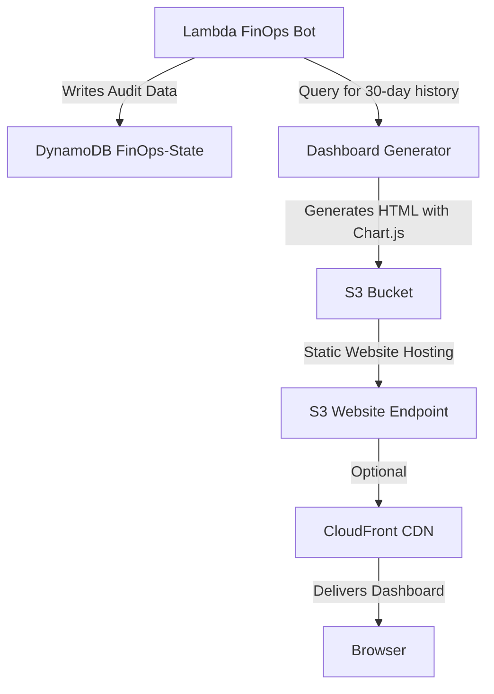

# Frontend Dashboard Design: Cloud FinOps Bot

**Document:** 12
**Version:** 2.0 (Go Edition - Audited & Patched)
**Author:** Jibrin Ahmed
**Date:** June 19, 2026
**Status:** Final

---

## 1. Document Purpose

This document defines the **frontend dashboard** for the Cloud FinOps Bot. It covers:

- **Dashboard Purpose:** What the dashboard displays and who uses it.
- **User Interface Design:** Layout, components, and visual design.
- **Data Flow:** How data moves from DynamoDB to the browser.
- **Technology Stack:** HTML, CSS, JavaScript, and Chart.js.
- **Deployment:** S3 static website hosting with CloudFront.
- **Implementation Details:** Code structure and key functions.
- **Security:** Authentication and access control.
- **Operational Considerations:** Caching, error handling, and retention.

**Audience:**
- **Developers:** Building the dashboard.
- **Stakeholders:** Understanding cost savings visually.
- **Future Employers:** Demonstrates full-stack capability.

---

## 2. Dashboard Overview

### 2.1 Purpose

The FinOps Bot Dashboard provides a **visual, at-a-glance view** of cloud cost savings achieved by the bot. It answers key questions:

- **How much money did we save this month?** (Total savings)
- **Which resource types saved the most?** (Breakdown by EBS, EIP, Snapshots, RDS)
- **Is our savings trend improving?** (Monthly trends over time)
- **What resources were deleted or stopped?** (Audit trail)
- **Is the bot healthy and running?** (Health indicator)

### 2.2 Target Audience

| Audience | Needs |
| :--- | :--- |
| **Engineering Managers** | See cost savings impact at a glance. |
| **Finance Teams** | Validate cloud cost reduction efforts. |
| **DevOps Engineers** | Audit what resources were cleaned up. |
| **Interviewers** | Evaluate full-stack and data visualization skills. |

### 2.3 User Stories

| Story | Priority |
| :--- | :--- |
| As a manager, I want to see total savings this month on one screen. | **P0** |
| As a manager, I want to see savings broken down by resource type. | **P0** |
| As a manager, I want to see savings trends over the past 6 months. | **P1** |
| As a DevOps engineer, I want to see a list of deleted resources. | **P1** |
| As a DevOps engineer, I want to see quarantine warnings. | **P2** |
| As a user, I want to know if the bot is healthy and running. | **P0** |
| As a user, I want the dashboard to load in under 2 seconds. | **P1** |
| As a user, I want the dashboard to work on mobile devices. | **P2** |

---

## 3. Architecture Overview

### 3.1 Data Flow Diagram



### 3.2 Dashboard Generation Frequency

| Frequency | Trigger | Method |
| :--- | :--- | :--- |
| **Daily** | After each Lambda run | Lambda generates and uploads new dashboard HTML |
| **On-Demand** | Manual trigger | Invoke Lambda manually to regenerate |
| **Initial** | First deployment | Terraform deploys a placeholder dashboard |

### 3.3 Deployment Architecture

```
┌─────────────────────────────────────────────────────────────────┐
│                    Frontend Deployment                          │
├─────────────────────────────────────────────────────────────────┤
│                                                                 │
│  ┌──────────────────────────────────────────────────────────┐  │
│  │              S3 Bucket: finops-audit-<account-id>       │  │
│  │                                                          │  │
│  │  ┌────────────────────────────────────────────────────┐ │  │
│  │  │              /audit/index.html                     │ │  │
│  │  │         Static HTML Dashboard with Chart.js       │ │  │
│  │  └────────────────────────────────────────────────────┘ │  │
│  │                                                          │  │
│  │  ┌────────────────────────────────────────────────────┐ │  │
│  │  │           /audit/YYYY-MM-DD/audit-*.json          │ │  │
│  │  │                Raw Audit Data                      │ │  │
│  │  └────────────────────────────────────────────────────┘ │  │
│  └──────────────────────────────────────────────────────────┘  │
│                              │                                  │
│                              ▼                                  │
│  ┌──────────────────────────────────────────────────────────┐  │
│  │          S3 Static Website Hosting (Enabled)             │  │
│  │          Index: index.html                               │  │
│  │          Error: index.html                               │  │
│  └──────────────────────────────────────────────────────────┘  │
│                              │                                  │
│                              ▼                                  │
│  ┌──────────────────────────────────────────────────────────┐  │
│  │          CloudFront Distribution (Optional)              │  │
│  │          + HTTPS + Custom Domain + Caching             │  │
│  └──────────────────────────────────────────────────────────┘  │
│                              │                                  │
│                              ▼                                  │
│  ┌──────────────────────────────────────────────────────────┐  │
│  │              Browser (https://dashboard.example.com)     │  │
│  └──────────────────────────────────────────────────────────┘  │
│                                                                 │
└─────────────────────────────────────────────────────────────────┘
```

### 3.4 Data Flow (Detailed)

1. **Lambda Execution:** The FinOps Bot runs and processes resources.
2. **DynamoDB Write:** Each deletion/stop action writes a record to the `FinOps-State` table with `ActionTaken = "DELETED"` or `"STOPPED"` and `EstimatedSavings`.
3. **Dashboard Query:** The Lambda queries DynamoDB using `QueryDeletedResources()` to fetch all records from the last 30 days.
4. **Data Aggregation:** The Lambda aggregates savings by resource type and by month using `calculateBreakdown()` and `calculateMonthlyTrend()`.
5. **HTML Generation:** The Lambda generates the full HTML page with embedded JSON data using `GenerateDashboardHTML()`.
6. **S3 Upload:** The Lambda uploads the HTML to S3 with `Content-Type: text/html`.
7. **Serving:** The S3 static website (or CloudFront) serves the HTML to the user's browser.
8. **Client-Side Rendering:** The browser loads the HTML, parses the embedded JSON, and renders charts and tables using Chart.js.

### 3.5 Data Retention & Pagination

| Aspect | Strategy |
| :--- | :--- |
| **Data Retention** | DynamoDB TTL deletes records after 90 days. Dashboard queries only the last 30 days. |
| **Query Limit** | `QueryDeletedResources()` limits to 100 records (most recent). |
| **Pagination** | If more than 100 records exist, the dashboard will show "View More" or page through results. |
| **Dashboard History** | The dashboard always shows the latest 30-day snapshot. Historical dashboards are not archived. |

**Future Enhancement:** Archive historical dashboards to S3 Glacier monthly for compliance.

---

## 4. User Interface Design

### 4.1 Page Layout (Updated with Health Indicator)

```
┌─────────────────────────────────────────────────────────────────┐
│  🚀 Cloud FinOps Bot Dashboard                         [Date]  │
│  🔵 System Healthy       Last updated: 2026-06-19 02:00:00   │
├─────────────────────────────────────────────────────────────────┤
│                                                                 │
│  ┌──────────────────────────────────────────────────────────┐  │
│  │  💰 Total Monthly Savings                                │  │
│  │                    $ 1,247.50                            │  │
│  └──────────────────────────────────────────────────────────┘  │
│                                                                 │
│  ┌──────────────┐  ┌──────────────┐  ┌──────────────┐        │
│  │  💾 EBS       │  │  🌐 EIP      │  │  📸 Snapshots │        │
│  │  $320.00      │  │  $72.00      │  │  $45.50      │        │
│  │  ▲ 12%        │  │  ▲ 5%        │  │  ▼ 3%        │        │
│  └──────────────┘  └──────────────┘  └──────────────┘        │
│                                                                 │
│  ┌──────────────┐  ┌──────────────────────────────────────┐  │
│  │  🗄️ RDS      │  │   📈 Monthly Savings Trend           │  │
│  │  $810.00     │  │   (Chart.js Line Chart)             │  │
│  │  ▲ 8%        │  │                                      │  │
│  └──────────────┘  └──────────────────────────────────────┘  │
│                                                                 │
│  ┌──────────────────────────────────────────────────────────┐  │
│  │  📋 Recent Activity                                      │  │
│  │  ┌────────────────────────────────────────────────────┐ │  │
│  │  │  ✅ vol-abc123  │  EBS Volume  │ $8.00 │ DELETED │ │  │
│  │  │  ✅ snap-xyz789 │  Snapshot    │ $2.50 │ DELETED │ │  │
│  │  │  ⚠️ vol-def456  │  EBS Volume  │ $4.00 │ QUAR..  │ │  │
│  │  └────────────────────────────────────────────────────┘ │  │
│  └──────────────────────────────────────────────────────────┘  │
│                                                                 │
│  📊 Dashboard automatically updates daily from FinOps Bot      │
│  ⏱️ Last updated: 2026-06-19 02:00:00 UTC                     │
│                                                                 │
└─────────────────────────────────────────────────────────────────┘
```

**Health Indicators:**
- ✅ **Green (Healthy):** Bot ran successfully in the last 24 hours.
- ⚠️ **Yellow (Stale):** Bot hasn't run in 24-48 hours.
- ❌ **Red (Critical):** Bot hasn't run in >48 hours or has errors.

### 4.2 Component Descriptions

| Component | Purpose | Data Source |
| :--- | :--- | :--- |
| **Health Indicator** | Shows bot health status | Lambda run timestamp vs. current time |
| **Hero Banner** | Total monthly savings (big number) | Aggregated from DynamoDB `EstimatedSavings` |
| **Resource Cards** | Savings breakdown by resource type | Aggregated from DynamoDB `ResourceType` |
| **Trend Chart** | Monthly savings over time | Aggregated by `DeletionTimestamp` month |
| **Activity Table** | Recent resources deleted or quarantined | Query from DynamoDB `ActionTaken` |
| **Status Bar** | Last updated timestamp + health status | Lambda run timestamp |

### 4.3 Color Palette

| Element | Color | Hex |
| :--- | :--- | :--- |
| **Primary Background** | Dark slate | `#1a202c` |
| **Card Background** | Dark gray | `#2d3748` |
| **Text Primary** | Light gray | `#e2e8f0` |
| **Text Highlight** | White | `#ffffff` |
| **Savings Positive** | Green | `#48bb78` |
| **Savings Negative** | Red | `#fc8181` |
| **Card Accent EBS** | Blue | `#4299e1` |
| **Card Accent EIP** | Purple | `#9f7aea` |
| **Card Accent Snapshots** | Yellow | `#ecc94b` |
| **Card Accent RDS** | Teal | `#38b2ac` |
| **Health Healthy** | Green | `#48bb78` |
| **Health Warning** | Yellow | `#ecc94b` |
| **Health Critical** | Red | `#fc8181` |

---

## 5. Technology Stack

| Component | Technology | Purpose |
| :--- | :--- | :--- |
| **HTML** | HTML5 | Page structure |
| **CSS** | CSS3 + Flexbox/Grid | Responsive layout |
| **JavaScript** | Vanilla JS (ES6) | Data fetching and rendering |
| **Charting** | Chart.js (CDN) | Savings trend visualization |
| **Icons** | Font Awesome (CDN) | Visual icons |
| **Fonts** | Google Fonts (Inter) | Typography |
| **Hosting** | AWS S3 | Static file hosting |
| **CDN** | AWS CloudFront (Optional) | HTTPS + caching |
| **Data Source** | Embedded JSON (daily generated) | Audit data |
| **Auth (Optional)** | CloudFront Signed URLs | Access control |

---

## 6. Implementation

### 6.1 Dashboard HTML Template

```html
<!DOCTYPE html>
<html lang="en">
<head>
    <meta charset="UTF-8">
    <meta name="viewport" content="width=device-width, initial-scale=1.0">
    <title>Cloud FinOps Bot Dashboard</title>
    
    <!-- Google Fonts -->
    <link href="https://fonts.googleapis.com/css2?family=Inter:wght@400;600;700;800&display=swap" rel="stylesheet">
    <!-- Font Awesome -->
    <link rel="stylesheet" href="https://cdnjs.cloudflare.com/ajax/libs/font-awesome/6.4.0/css/all.min.css">
    <!-- Chart.js -->
    <script src="https://cdn.jsdelivr.net/npm/chart.js"></script>
    
    <style>
        /* ... full CSS (see Section 6.2) ... */
    </style>
</head>
<body>
    <!-- Dashboard Structure -->
    <div class="dashboard">
        <!-- Header with Health Indicator -->
        <header class="header">
            <div class="header-left">
                <h1><i class="fas fa-rocket"></i> Cloud FinOps Bot</h1>
                <span class="badge">v1.0</span>
            </div>
            <div class="header-center">
                <span class="health-indicator" id="healthStatus">
                    <i class="fas fa-circle"></i> System Healthy
                </span>
            </div>
            <div class="header-right">
                <span id="lastUpdated">Loading...</span>
            </div>
        </header>

        <!-- Hero Section -->
        <section class="hero">
            <div class="hero-content">
                <div class="hero-label">Total Monthly Savings</div>
                <div class="hero-value" id="totalSavings">$0.00</div>
                <div class="hero-sub">
                    <span id="resourceCount">0</span> resources deleted this month
                </div>
            </div>
        </section>

        <!-- Resource Cards -->
        <section class="cards">
            <div class="card" id="card-ebs">
                <div class="card-icon"><i class="fas fa-hdd"></i></div>
                <div class="card-label">EBS Volumes</div>
                <div class="card-value" id="savingsEBS">$0.00</div>
                <div class="card-count" id="countEBS">0 deleted</div>
            </div>
            <div class="card" id="card-eip">
                <div class="card-icon"><i class="fas fa-globe"></i></div>
                <div class="card-label">Elastic IPs</div>
                <div class="card-value" id="savingsEIP">$0.00</div>
                <div class="card-count" id="countEIP">0 released</div>
            </div>
            <div class="card" id="card-snapshot">
                <div class="card-icon"><i class="fas fa-camera"></i></div>
                <div class="card-label">Snapshots</div>
                <div class="card-value" id="savingsSnapshot">$0.00</div>
                <div class="card-count" id="countSnapshot">0 deleted</div>
            </div>
            <div class="card" id="card-rds">
                <div class="card-icon"><i class="fas fa-database"></i></div>
                <div class="card-label">RDS Instances</div>
                <div class="card-value" id="savingsRDS">$0.00</div>
                <div class="card-count" id="countRDS">0 stopped</div>
            </div>
        </section>

        <!-- Charts -->
        <section class="charts">
            <div class="chart-container" id="trendChartContainer">
                <h3><i class="fas fa-chart-line"></i> Monthly Savings Trend</h3>
                <canvas id="savingsChart"></canvas>
            </div>
            <div class="chart-container" id="pieChartContainer">
                <h3><i class="fas fa-chart-pie"></i> Savings by Resource</h3>
                <canvas id="resourceChart"></canvas>
            </div>
        </section>

        <!-- Activity Table -->
        <section class="activity">
            <h3><i class="fas fa-list"></i> Recent Activity</h3>
            <div class="table-wrapper">
                <table id="activityTable">
                    <thead>
                        <tr>
                            <th>Resource ID</th>
                            <th>Type</th>
                            <th>Savings</th>
                            <th>Action</th>
                            <th>Date</th>
                        </tr>
                    </thead>
                    <tbody id="activityBody">
                        <!-- Populated by JavaScript -->
                    </tbody>
                </table>
            </div>
        </section>

        <!-- Footer -->
        <footer class="footer">
            <p>Dashboard automatically updates daily from FinOps Bot</p>
            <p class="small">Data refreshed every 24 hours. All values are estimated monthly savings.</p>
        </footer>
    </div>

    <script>
        // ... full JavaScript (see Section 6.3) ...
    </script>
</body>
</html>
```

### 6.2 CSS Styles (Full)

```css
/* dashboard.css */

* {
    margin: 0;
    padding: 0;
    box-sizing: border-box;
}

body {
    font-family: 'Inter', -apple-system, BlinkMacSystemFont, sans-serif;
    background: #0f1419;
    color: #e2e8f0;
    padding: 20px;
    min-height: 100vh;
}

.dashboard {
    max-width: 1200px;
    margin: 0 auto;
}

/* Header */
.header {
    display: flex;
    justify-content: space-between;
    align-items: center;
    padding: 16px 24px;
    background: #1a202c;
    border-radius: 12px;
    border: 1px solid #2d3748;
    margin-bottom: 24px;
    flex-wrap: wrap;
    gap: 8px;
}

.header-left {
    display: flex;
    align-items: center;
    gap: 12px;
}

.header-left h1 {
    font-size: 20px;
    font-weight: 700;
    color: #fff;
}

.header-left h1 i {
    color: #4299e1;
    margin-right: 8px;
}

.badge {
    background: #2d3748;
    padding: 2px 10px;
    border-radius: 12px;
    font-size: 11px;
    font-weight: 600;
    color: #a0aec0;
}

.header-center {
    display: flex;
    align-items: center;
}

.health-indicator {
    display: flex;
    align-items: center;
    gap: 8px;
    font-size: 14px;
    font-weight: 600;
    padding: 4px 12px;
    border-radius: 20px;
}

.health-indicator i {
    font-size: 10px;
}

.health-indicator.healthy {
    color: #48bb78;
    background: rgba(72, 187, 120, 0.15);
}

.health-indicator.warning {
    color: #ecc94b;
    background: rgba(236, 201, 75, 0.15);
}

.health-indicator.critical {
    color: #fc8181;
    background: rgba(252, 129, 129, 0.15);
}

.header-right {
    color: #a0aec0;
    font-size: 13px;
}

/* Hero */
.hero {
    background: linear-gradient(135deg, #1a202c 0%, #2d3748 100%);
    border-radius: 16px;
    padding: 40px 48px;
    margin-bottom: 24px;
    border: 1px solid #2d3748;
    text-align: center;
}

.hero-label {
    font-size: 14px;
    font-weight: 600;
    color: #a0aec0;
    text-transform: uppercase;
    letter-spacing: 1px;
}

.hero-value {
    font-size: 56px;
    font-weight: 800;
    color: #48bb78;
    margin: 8px 0;
    letter-spacing: -1px;
}

.hero-sub {
    font-size: 14px;
    color: #a0aec0;
}

.hero-sub span {
    color: #e2e8f0;
    font-weight: 600;
}

/* Cards */
.cards {
    display: grid;
    grid-template-columns: repeat(4, 1fr);
    gap: 16px;
    margin-bottom: 24px;
}

.card {
    background: #1a202c;
    border-radius: 12px;
    padding: 20px 24px;
    border: 1px solid #2d3748;
    transition: all 0.2s;
}

.card:hover {
    border-color: #4299e1;
    transform: translateY(-2px);
}

.card-icon {
    font-size: 20px;
    margin-bottom: 8px;
}

#card-ebs .card-icon { color: #4299e1; }
#card-eip .card-icon { color: #9f7aea; }
#card-snapshot .card-icon { color: #ecc94b; }
#card-rds .card-icon { color: #38b2ac; }

.card-label {
    font-size: 12px;
    font-weight: 600;
    color: #a0aec0;
    text-transform: uppercase;
    letter-spacing: 0.5px;
}

.card-value {
    font-size: 24px;
    font-weight: 700;
    color: #e2e8f0;
    margin: 4px 0;
}

.card-count {
    font-size: 12px;
    color: #a0aec0;
}

/* Charts */
.charts {
    display: grid;
    grid-template-columns: 2fr 1fr;
    gap: 16px;
    margin-bottom: 24px;
}

.chart-container {
    background: #1a202c;
    border-radius: 12px;
    padding: 20px 24px;
    border: 1px solid #2d3748;
    min-height: 200px;
}

.chart-container h3 {
    font-size: 14px;
    font-weight: 600;
    color: #a0aec0;
    margin-bottom: 16px;
}

.chart-container h3 i {
    margin-right: 8px;
    color: #4299e1;
}

.chart-container canvas {
    max-height: 250px;
}

/* Empty State */
.empty-state {
    display: flex;
    flex-direction: column;
    align-items: center;
    justify-content: center;
    padding: 40px 20px;
    color: #a0aec0;
    text-align: center;
}

.empty-state i {
    font-size: 48px;
    color: #2d3748;
    margin-bottom: 16px;
}

.empty-state p {
    font-size: 14px;
    max-width: 400px;
}

/* Activity Table */
.activity {
    background: #1a202c;
    border-radius: 12px;
    padding: 20px 24px;
    border: 1px solid #2d3748;
    margin-bottom: 24px;
}

.activity h3 {
    font-size: 14px;
    font-weight: 600;
    color: #a0aec0;
    margin-bottom: 16px;
}

.activity h3 i {
    margin-right: 8px;
    color: #4299e1;
}

.table-wrapper {
    overflow-x: auto;
}

table {
    width: 100%;
    border-collapse: collapse;
    font-size: 13px;
}

thead {
    background: #0f1419;
}

th {
    padding: 10px 12px;
    text-align: left;
    font-weight: 600;
    color: #a0aec0;
    border-bottom: 1px solid #2d3748;
}

td {
    padding: 10px 12px;
    border-bottom: 1px solid #2d3748;
    color: #e2e8f0;
}

tr:hover {
    background: #0f1419;
}

.status-deleted {
    color: #48bb78;
}

.status-quarantined {
    color: #ecc94b;
}

.status-stopped {
    color: #38b2ac;
}

.status-failed {
    color: #fc8181;
}

/* Footer */
.footer {
    text-align: center;
    padding: 16px 0;
    color: #718096;
    font-size: 13px;
}

.footer .small {
    font-size: 11px;
    margin-top: 4px;
}

/* Responsive */
@media (max-width: 768px) {
    .cards {
        grid-template-columns: repeat(2, 1fr);
    }
    
    .charts {
        grid-template-columns: 1fr;
    }
    
    .hero-value {
        font-size: 36px;
    }
    
    .header {
        flex-direction: column;
        gap: 8px;
        text-align: center;
    }
}

@media (max-width: 480px) {
    .cards {
        grid-template-columns: 1fr;
    }
    
    .hero {
        padding: 24px 16px;
    }
    
    .hero-value {
        font-size: 28px;
    }
}
```

### 6.3 JavaScript (Full)

```javascript
// dashboard.js

// Chart.js default color palette for dark theme
Chart.defaults.color = '#a0aec0';
Chart.defaults.borderColor = '#2d3748';

// Data will be embedded in the HTML by the Lambda generator
// This is a template for how the data structure should look
const dashboardData = {
    totalSavings: 1247.50,
    lastUpdated: '2026-06-19 02:00:00 UTC',
    healthStatus: 'healthy', // 'healthy', 'warning', 'critical'
    breakdown: {
        ebs: { savings: 320.00, count: 12 },
        eip: { savings: 72.00, count: 5 },
        snapshot: { savings: 45.50, count: 8 },
        rds: { savings: 810.00, count: 3 }
    },
    monthlyTrend: [
        { month: 'Jan', savings: 850.00 },
        { month: 'Feb', savings: 920.00 },
        { month: 'Mar', savings: 980.00 },
        { month: 'Apr', savings: 1100.00 },
        { month: 'May', savings: 1150.00 },
        { month: 'Jun', savings: 1247.50 }
    ],
    recentActivity: [
        { resourceId: 'vol-abc123', type: 'EBS Volume', savings: 8.00, action: 'DELETED', date: '2026-06-19' },
        { resourceId: 'snap-xyz789', type: 'Snapshot', savings: 2.50, action: 'DELETED', date: '2026-06-19' },
        { resourceId: 'vol-def456', type: 'EBS Volume', savings: 4.00, action: 'QUARANTINED', date: '2026-06-18' }
    ]
};

// Populate health indicator
const healthEl = document.getElementById('healthStatus');
if (dashboardData.healthStatus === 'healthy') {
    healthEl.className = 'health-indicator healthy';
    healthEl.innerHTML = '<i class="fas fa-circle"></i> System Healthy';
} else if (dashboardData.healthStatus === 'warning') {
    healthEl.className = 'health-indicator warning';
    healthEl.innerHTML = '<i class="fas fa-circle"></i> Data Stale (24-48h)';
} else {
    healthEl.className = 'health-indicator critical';
    healthEl.innerHTML = '<i class="fas fa-circle"></i> System Critical (No Data)';
}

// Populate hero section
document.getElementById('totalSavings').textContent = '$' + dashboardData.totalSavings.toFixed(2);
document.getElementById('lastUpdated').textContent = 'Last updated: ' + dashboardData.lastUpdated;

// Calculate total resources
const totalResources = dashboardData.breakdown.ebs.count + 
                       dashboardData.breakdown.eip.count + 
                       dashboardData.breakdown.snapshot.count + 
                       dashboardData.breakdown.rds.count;
document.getElementById('resourceCount').textContent = totalResources;

// Populate resource cards
document.getElementById('savingsEBS').textContent = '$' + dashboardData.breakdown.ebs.savings.toFixed(2);
document.getElementById('countEBS').textContent = dashboardData.breakdown.ebs.count + ' deleted';

document.getElementById('savingsEIP').textContent = '$' + dashboardData.breakdown.eip.savings.toFixed(2);
document.getElementById('countEIP').textContent = dashboardData.breakdown.eip.count + ' released';

document.getElementById('savingsSnapshot').textContent = '$' + dashboardData.breakdown.snapshot.savings.toFixed(2);
document.getElementById('countSnapshot').textContent = dashboardData.breakdown.snapshot.count + ' deleted';

document.getElementById('savingsRDS').textContent = '$' + dashboardData.breakdown.rds.savings.toFixed(2);
document.getElementById('countRDS').textContent = dashboardData.breakdown.rds.count + ' stopped';

// Populate activity table
const tbody = document.getElementById('activityBody');

if (dashboardData.recentActivity && dashboardData.recentActivity.length > 0) {
    dashboardData.recentActivity.forEach(item => {
        const tr = document.createElement('tr');
        const actionClass = 'status-' + item.action.toLowerCase();
        tr.innerHTML = `
            <td><code>${item.resourceId}</code></td>
            <td>${item.type}</td>
            <td>$${item.savings.toFixed(2)}</td>
            <td><span class="${actionClass}">${item.action}</span></td>
            <td>${item.date}</td>
        `;
        tbody.appendChild(tr);
    });
} else {
    tbody.innerHTML = '<tr><td colspan="5" style="text-align:center;color:#a0aec0;">No recent activity</td></tr>';
}

// Check if data exists before rendering charts
if (dashboardData.monthlyTrend && dashboardData.monthlyTrend.length > 0) {
    // Create monthly savings trend chart (Line Chart)
    const ctx1 = document.getElementById('savingsChart').getContext('2d');
    new Chart(ctx1, {
        type: 'line',
        data: {
            labels: dashboardData.monthlyTrend.map(d => d.month),
            datasets: [{
                label: 'Monthly Savings ($)',
                data: dashboardData.monthlyTrend.map(d => d.savings),
                borderColor: '#48bb78',
                backgroundColor: 'rgba(72, 187, 120, 0.1)',
                fill: true,
                tension: 0.4,
                pointBackgroundColor: '#48bb78',
                pointBorderColor: '#1a202c',
                pointBorderWidth: 2
            }]
        },
        options: {
            responsive: true,
            maintainAspectRatio: false,
            plugins: {
                legend: {
                    display: false
                }
            },
            scales: {
                y: {
                    beginAtZero: true,
                    grid: {
                        color: 'rgba(160, 174, 192, 0.1)'
                    },
                    ticks: {
                        callback: function(value) {
                            return '$' + value;
                        }
                    }
                },
                x: {
                    grid: {
                        display: false
                    }
                }
            }
        }
    });

    // Create resource breakdown chart (Pie Chart)
    const ctx2 = document.getElementById('resourceChart').getContext('2d');
    new Chart(ctx2, {
        type: 'doughnut',
        data: {
            labels: ['EBS Volumes', 'Elastic IPs', 'Snapshots', 'RDS Instances'],
            datasets: [{
                data: [
                    dashboardData.breakdown.ebs.savings,
                    dashboardData.breakdown.eip.savings,
                    dashboardData.breakdown.snapshot.savings,
                    dashboardData.breakdown.rds.savings
                ],
                backgroundColor: [
                    '#4299e1',
                    '#9f7aea',
                    '#ecc94b',
                    '#38b2ac'
                ],
                borderColor: '#1a202c',
                borderWidth: 2
            }]
        },
        options: {
            responsive: true,
            maintainAspectRatio: false,
            plugins: {
                legend: {
                    position: 'bottom',
                    labels: {
                        padding: 16,
                        usePointStyle: true,
                        pointStyle: 'circle'
                    }
                }
            }
        }
    });
} else {
    // Show empty state
    document.getElementById('trendChartContainer').innerHTML = 
        '<div class="empty-state"><i class="fas fa-info-circle"></i><p>No data available yet. The bot will start collecting data after its first run.</p></div>';
    document.getElementById('pieChartContainer').innerHTML = 
        '<div class="empty-state"><i class="fas fa-info-circle"></i><p>No data available yet. The bot will start collecting data after its first run.</p></div>';
}
```

---

## 7. Go Implementation for Dashboard Generation

### 7.1 Dashboard Generator Function

```go
// internal/s3/dashboard.go

package s3

import (
    "encoding/json"
    "fmt"
    "strings"
    "time"
    "finops-bot/internal/dynamodb"
)

type DashboardData struct {
    TotalSavings   float64                    `json:"totalSavings"`
    LastUpdated    string                     `json:"lastUpdated"`
    HealthStatus   string                     `json:"healthStatus"` // "healthy", "warning", "critical"
    Breakdown      ResourceBreakdown          `json:"breakdown"`
    MonthlyTrend   []MonthlyTrendData         `json:"monthlyTrend"`
    RecentActivity []dynamodb.ResourceState   `json:"recentActivity"`
}

type ResourceBreakdown struct {
    EBS      ResourceMetrics `json:"ebs"`
    EIP      ResourceMetrics `json:"eip"`
    Snapshot ResourceMetrics `json:"snapshot"`
    RDS      ResourceMetrics `json:"rds"`
}

type ResourceMetrics struct {
    Savings float64 `json:"savings"`
    Count   int     `json:"count"`
}

type MonthlyTrendData struct {
    Month   string  `json:"month"`
    Savings float64 `json:"savings"`
}

// GenerateDashboardHTML generates the full dashboard HTML with embedded data.
func GenerateDashboardHTML(records []dynamodb.ResourceState, totalSavings float64, eventTimestamp time.Time) string {
    // Determine health status based on last run time
    healthStatus := "healthy"
    hoursSinceRun := time.Since(eventTimestamp).Hours()
    if hoursSinceRun > 48 {
        healthStatus = "critical"
    } else if hoursSinceRun > 24 {
        healthStatus = "warning"
    }
    
    data := DashboardData{
        TotalSavings: totalSavings,
        LastUpdated:  eventTimestamp.UTC().Format("2006-01-02 15:04:05 UTC"),
        HealthStatus: healthStatus,
        Breakdown:    calculateBreakdown(records),
        MonthlyTrend: calculateMonthlyTrend(records),
        RecentActivity: getRecentActivity(records, 20),
    }
    
    // Marshal data to JSON for embedding in HTML
    jsonData, _ := json.Marshal(data)
    
    // Build the full HTML with embedded data
    return buildHTML(string(jsonData))
}

func calculateBreakdown(records []dynamodb.ResourceState) ResourceBreakdown {
    breakdown := ResourceBreakdown{}
    for _, r := range records {
        if r.ActionTaken != "DELETED" && r.ActionTaken != "STOPPED" {
            continue
        }
        savings := 0.0
        if r.EstimatedSavings != nil {
            savings = *r.EstimatedSavings
        }
        switch r.ResourceType {
        case "EBS_VOLUME":
            breakdown.EBS.Savings += savings
            breakdown.EBS.Count++
        case "EIP":
            breakdown.EIP.Savings += savings
            breakdown.EIP.Count++
        case "SNAPSHOT":
            breakdown.Snapshot.Savings += savings
            breakdown.Snapshot.Count++
        case "RDS_INSTANCE":
            breakdown.RDS.Savings += savings
            breakdown.RDS.Count++
        }
    }
    return breakdown
}

func calculateMonthlyTrend(records []dynamodb.ResourceState) []MonthlyTrendData {
    // Group by month and sum savings
    monthlyMap := make(map[string]float64)
    for _, r := range records {
        if r.ActionTaken != "DELETED" && r.ActionTaken != "STOPPED" {
            continue
        }
        if r.EstimatedSavings == nil {
            continue
        }
        if r.DeletionTimestamp == nil {
            continue
        }
        t := time.Unix(*r.DeletionTimestamp, 0)
        monthKey := t.Format("Jan")
        monthlyMap[monthKey] += *r.EstimatedSavings
    }
    
    // Convert to sorted slice
    var trend []MonthlyTrendData
    monthOrder := []string{"Jan", "Feb", "Mar", "Apr", "May", "Jun", "Jul", "Aug", "Sep", "Oct", "Nov", "Dec"}
    for _, month := range monthOrder {
        if val, ok := monthlyMap[month]; ok {
            trend = append(trend, MonthlyTrendData{Month: month, Savings: val})
        }
    }
    return trend
}

func getRecentActivity(records []dynamodb.ResourceState, limit int) []dynamodb.ResourceState {
    // Sort by deletion timestamp descending and return top N
    // Implementation depends on sorting logic
    if len(records) > limit {
        return records[:limit]
    }
    return records
}

func buildHTML(jsonData string) string {
    // This template contains the full HTML, CSS, and JavaScript
    // with the JSON data injected into the dashboardData variable
    return fmt.Sprintf(`<!DOCTYPE html>
<html>
<head>
    <meta charset="UTF-8">
    <meta name="viewport" content="width=device-width, initial-scale=1.0">
    <title>Cloud FinOps Bot Dashboard</title>
    <link href="https://fonts.googleapis.com/css2?family=Inter:wght@400;600;700;800&display=swap" rel="stylesheet">
    <link rel="stylesheet" href="https://cdnjs.cloudflare.com/ajax/libs/font-awesome/6.4.0/css/all.min.css">
    <script src="https://cdn.jsdelivr.net/npm/chart.js"></script>
    <style>/* CSS from Section 6.2 */</style>
</head>
<body>
    <!-- Dashboard HTML structure -->
    <div class="dashboard">
        <!-- Header, Hero, Cards, Charts, Activity, Footer -->
    </div>
    <script>
        // Inject data
        const dashboardData = %s;
        // ... rest of JavaScript from Section 6.3 ...
    </script>
</body>
</html>`, jsonData)
}
```

---

## 8. Integration with Lambda

### 8.1 Dashboard Generation in Lambda

```go
// cmd/runner.go

func (r *Runner) generateReport(ctx context.Context, results []regionResult, eventTimestamp time.Time) (*pricing.SavingsReport, error) {
    // ... existing code ...
    
    // Query DynamoDB for 30-day history
    startTime := time.Now().AddDate(0, -1, 0).Unix()
    records, err := dynamodb.QueryDeletedResources(ctx, r.dynamoClient, startTime)
    if err != nil {
        return nil, fmt.Errorf("failed to query deleted resources: %w", err)
    }
    
    // Generate HTML dashboard
    totalSavings := calculateTotalSavings(records)
    dashboardHTML := s3.GenerateDashboardHTML(records, totalSavings, eventTimestamp)
    
    // Upload to S3 with error handling
    if _, err := s3.UploadDashboard(ctx, r.s3Client, r.cfg.S3ReportBucket, r.cfg.S3ReportPrefix, dashboardHTML, eventTimestamp); err != nil {
        logger.Error("Failed to upload dashboard", "error", err)
        // Send a Slack alert
        r.sendSlackMessage("❌ Dashboard upload failed: " + err.Error())
        return nil, fmt.Errorf("dashboard upload failed: %w", err)
    }
    
    return report, nil
}
```

### 8.2 S3 Upload Function with Cache Busting

```go
// internal/s3/upload.go

func UploadDashboard(ctx context.Context, client *s3.Client, bucket, prefix, dashboardHTML string, eventTimestamp time.Time) (string, error) {
    // Use a versioned filename for cache busting
    version := eventTimestamp.Format("20060102-150405")
    key := fmt.Sprintf("%sdashboard-%s.html", prefix, version)
    
    // Upload versioned file
    _, err := client.PutObject(ctx, &s3.PutObjectInput{
        Bucket:        aws.String(bucket),
        Key:           aws.String(key),
        Body:          strings.NewReader(dashboardHTML),
        ContentType:   aws.String("text/html"),
        CacheControl:  aws.String("no-cache"), // Always fetch latest version
    })
    if err != nil {
        return "", err
    }
    
    // Also upload to index.html for easy access
    _, err = client.PutObject(ctx, &s3.PutObjectInput{
        Bucket:        aws.String(bucket),
        Key:           aws.String(prefix + "index.html"),
        Body:          strings.NewReader(dashboardHTML),
        ContentType:   aws.String("text/html"),
        CacheControl:  aws.String("max-age=3600"),
    })
    if err != nil {
        return "", err
    }
    
    return fmt.Sprintf("s3://%s/%s", bucket, key), nil
}
```

---

## 9. S3 Website Configuration

### 9.1 Terraform Configuration

```hcl
# terraform/s3.tf (Updated)

# S3 Bucket CORS Configuration
resource "aws_s3_bucket_cors_configuration" "audit_bucket" {
  bucket = aws_s3_bucket.audit_bucket.id

  cors_rule {
    allowed_headers = ["*"]
    allowed_methods = ["GET", "HEAD"]
    allowed_origins = ["https://dashboard.example.com"]
    max_age_seconds = 3000
  }
}

# S3 Bucket Website Configuration
resource "aws_s3_bucket_website_configuration" "audit_bucket" {
  bucket = aws_s3_bucket.audit_bucket.id
  
  index_document {
    suffix = "index.html"
  }
  
  error_document {
    key = "index.html"
  }
}

# S3 Bucket Policy for Website Access (Restricted)
resource "aws_s3_bucket_policy" "audit_bucket" {
  bucket = aws_s3_bucket.audit_bucket.id
  policy = jsonencode({
    Version = "2012-10-17"
    Statement = [
      {
        Sid = "DenyNonSSL"
        Effect = "Deny"
        Principal = "*"
        Action = "s3:*"
        Resource = [
          aws_s3_bucket.audit_bucket.arn,
          "${aws_s3_bucket.audit_bucket.arn}/*"
        ]
        Condition = {
          Bool = {
            "aws:SecureTransport": "false"
          }
        }
      }
    ]
  })
}
```

### 9.2 Terraform Outputs

```hcl
# terraform/outputs.tf (Updated)

output "dashboard_url" {
  description = "URL of the FinOps Bot dashboard"
  value       = aws_cloudfront_distribution.dashboard.domain_name != "" ? 
                "https://${aws_cloudfront_distribution.dashboard.domain_name}" : 
                "http://${aws_s3_bucket_website_configuration.audit_bucket.website_endpoint}"
}

output "dashboard_s3_uri" {
  description = "S3 URI of the dashboard"
  value       = "s3://${aws_s3_bucket.audit_bucket.bucket}/${var.s3_report_prefix}index.html"
}
```

---

## 10. Dashboard Authentication

### 10.1 Authentication Options

| Option | Implementation | Complexity |
| :--- | :--- | :--- |
| **CloudFront Signed URLs** | Restrict access to specific users with signed URLs. | Medium |
| **AWS WAF + IP Restriction** | Restrict to corporate IP ranges. | Medium |
| **S3 Bucket with Origin Access Control** | Restrict access to CloudFront only. | Low |
| **Basic Auth (CloudFront Functions)** | Username/password authentication at edge. | Low |

**Recommended (Lowest Complexity):**
- Block all public access to S3.
- Use CloudFront with Origin Access Control (OAC).
- Restrict CloudFront access via IP whitelist or signed URLs.

### 10.2 CloudFront with Origin Access Control

```hcl
# terraform/cloudfront.tf

resource "aws_cloudfront_distribution" "dashboard" {
  enabled = true
  price_class = "PriceClass_100"
  
  origin {
    domain_name = aws_s3_bucket.audit_bucket.bucket_regional_domain_name
    origin_id   = "S3-origin"
    origin_access_control_id = aws_cloudfront_origin_access_control.default.id
  }
  
  default_cache_behavior {
    target_origin_id = "S3-origin"
    viewer_protocol_policy = "redirect-to-https"
    allowed_methods = ["GET", "HEAD"]
    cached_methods = ["GET", "HEAD"]
    min_ttl = 0
    default_ttl = 3600
    max_ttl = 86400
    
    forwarded_values {
      query_string = false
      cookies {
        forward = "none"
      }
    }
  }
  
  restrictions {
    geo_restriction {
      restriction_type = "none"
    }
  }
  
  viewer_certificate {
    cloudfront_default_certificate = true
  }
}

resource "aws_cloudfront_origin_access_control" "default" {
  name                              = "finops-dashboard-oac"
  description                       = "OAC for FinOps Bot dashboard"
  origin_access_control_origin_type = "s3"
  signing_behavior                  = "always"
  signing_protocol                  = "sigv4"
}

resource "aws_s3_bucket_policy" "audit_bucket" {
  bucket = aws_s3_bucket.audit_bucket.id
  policy = jsonencode({
    Version = "2012-10-17"
    Statement = [
      {
        Sid = "DenyNonSSL"
        Effect = "Deny"
        Principal = "*"
        Action = "s3:*"
        Resource = [
          aws_s3_bucket.audit_bucket.arn,
          "${aws_s3_bucket.audit_bucket.arn}/*"
        ]
        Condition = {
          Bool = {
            "aws:SecureTransport": "false"
          }
        }
      },
      {
        Sid = "AllowCloudFrontRead"
        Effect = "Allow"
        Principal = {
          Service = "cloudfront.amazonaws.com"
        }
        Action = "s3:GetObject"
        Resource = "${aws_s3_bucket.audit_bucket.arn}/*"
        Condition = {
          StringEquals = {
            "aws:SourceArn" = aws_cloudfront_distribution.dashboard.arn
          }
        }
      }
    ]
  })
}
```

---

## 11. Testing the Dashboard

### 11.1 Manual Testing

```bash
# 1. Generate a test dashboard locally
go run cmd/generate_dashboard.go -output test_dashboard.html

# 2. Open in browser
open test_dashboard.html

# 3. Upload to S3 manually
aws s3 cp test_dashboard.html s3://finops-audit-<account-id>/audit/index.html --content-type text/html

# 4. Access the URL
echo "http://finops-audit-<account-id>.s3-website-<region>.amazonaws.com"
```

### 11.2 Responsive Testing Requirements

The dashboard must work on:
- **Desktop:** 1920x1080, 1366x768
- **Tablet:** iPad (1024x768), iPad Pro (1366x1024)
- **Mobile:** iPhone 12/13/14 (390x844), Android (412x915)

**Testing Tools:**
- Chrome DevTools Device Emulation
- Responsive Design Checker (browser extension)
- Real device testing (recommended)

**Acceptance Criteria:**
- All content fits on screen without horizontal scroll.
- Charts resize correctly.
- Text is readable (font size >= 14px).
- Touch targets are at least 44px.

### 11.3 Unit Test for Dashboard Generator

```go
// tests/unit/dashboard_test.go

package unit

import (
    "testing"
    "time"
    "strings"
    "finops-bot/internal/s3"
    "finops-bot/internal/dynamodb"
)

func TestGenerateDashboardHTML(t *testing.T) {
    eventTime := time.Now().Add(-2 * time.Hour) // 2 hours ago (healthy)
    records := []dynamodb.ResourceState{
        {ResourceType: "EBS_VOLUME", ActionTaken: "DELETED", EstimatedSavings: 8.0},
        {ResourceType: "EIP", ActionTaken: "DELETED", EstimatedSavings: 3.6},
    }
    
    html := s3.GenerateDashboardHTML(records, 11.6, eventTime)
    
    if !strings.Contains(html, "Total Monthly Savings") {
        t.Error("Dashboard missing total savings section")
    }
    if !strings.Contains(html, "11.60") {
        t.Error("Dashboard missing savings value")
    }
    if !strings.Contains(html, "Chart.js") {
        t.Error("Dashboard missing Chart.js reference")
    }
    if !strings.Contains(html, "healthy") {
        t.Error("Dashboard missing health indicator")
    }
}

func TestGenerateDashboardHTML_EmptyData(t *testing.T) {
    eventTime := time.Now().Add(-50 * time.Hour) // >48 hours (critical)
    records := []dynamodb.ResourceState{}
    
    html := s3.GenerateDashboardHTML(records, 0, eventTime)
    
    if !strings.Contains(html, "critical") {
        t.Error("Dashboard health indicator should be critical for stale data")
    }
}
```

---

## 12. Sign-Off

| Role | Name | Date | Signature |
| :--- | :--- | :--- | :--- |
| **Project Lead / Architect** | Jibrin Ahmed | June 19, 2026 | JA |
| **Frontend Reviewer** | [Frontend Team / Imaginary Lead] | [Date] | [Initials] |

---
